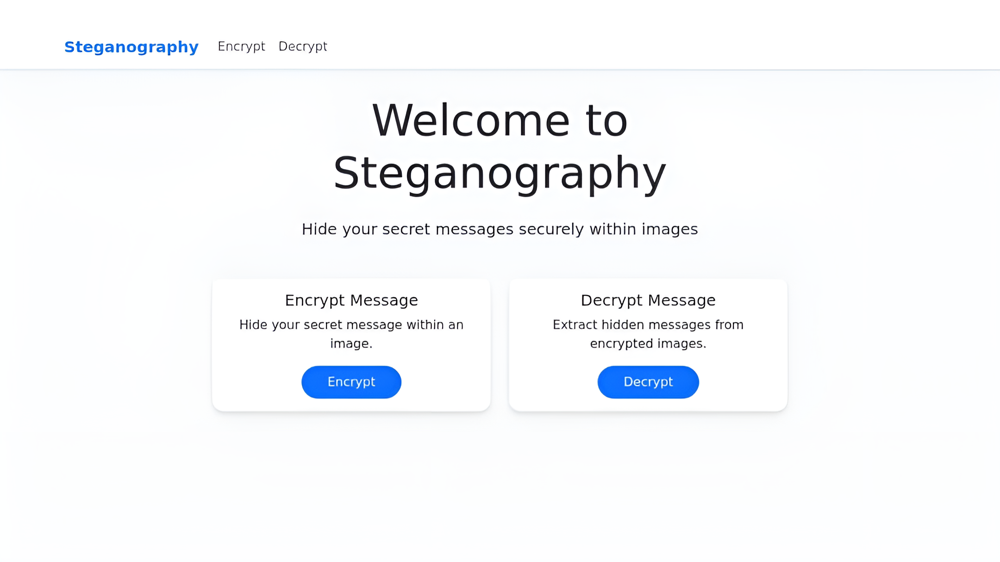
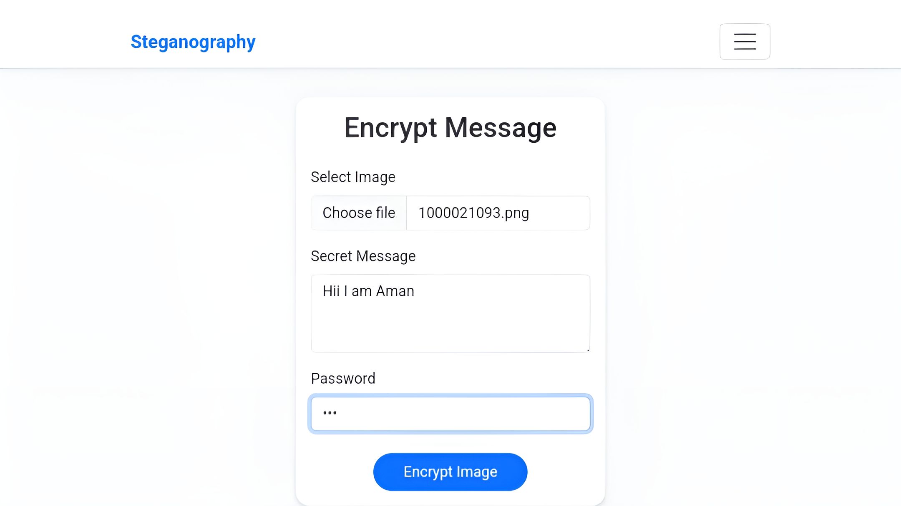
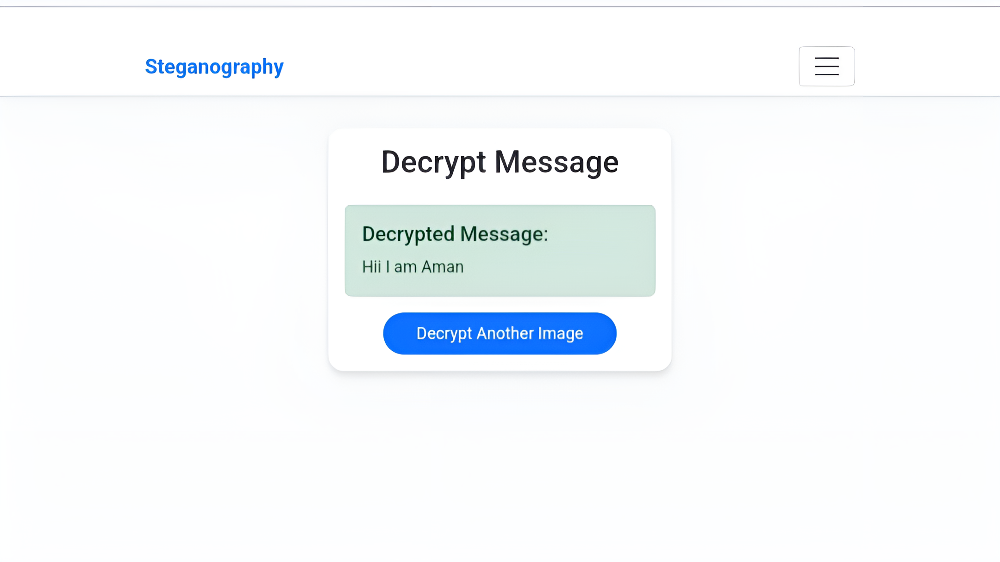

# Image Steganography Web App 🔒🖼️

A secure web application for hiding secret messages in images using XOR encryption and LSB steganography.





## Features ✨

- 🔑 Password-protected message encryption/decryption
- 🖼️ Supports JPG, PNG, and BMP image formats
- 🌐 Web-based user interface
- 📁 File upload/download functionality
- 🛡️ Basic XOR cipher encryption
- 📏 Automatic message length detection
- 📱 Responsive Bootstrap design

## Technologies Used 🛠️

- **Python** (Flask backend)
- **OpenCV** (Image processing)
- **Bootstrap** (Frontend design)
- **HTML5/CSS3** (UI components)
- **Werkzeug** (File upload handling)

## Installation 📦

### Prerequisites
- Python 3.8+
- pip package manager

### Setup Instructions

1. Clone the repository:
```bash
git clone https://github.com/amankumarcodes/Steganography-Application.git
cd Steganography-Application
```

2. Install dependencies:
```bash
pip install -r requirements.txt
```

3. Create required directories:
```bash
mkdir -p uploads
```

4. Set up environment variables:
```bash
export FLASK_APP=app.py
export FLASK_ENV=development  # Remove for production
```

## Usage 🚀

1. Start the application:
```bash
python app.py
```

2. Access the web interface at `http://localhost:5000`

### Encrypting a Message 🔒
1. Navigate to Encrypt page
2. Upload a cover image
3. Enter secret message and password
4. Download encrypted image

### Decrypting a Message 🔓
1. Navigate to Decrypt page
2. Upload encrypted image
3. Enter encryption password
4. View decrypted message


## Security Considerations 🔐

- Use strong passwords with mixed characters
- XOR encryption provides basic security (not military-grade)
- Keep encrypted images secure
- Maximum message capacity: `(width × height × 3) - 4` bytes

```
## Made with ❤️ by Aman
